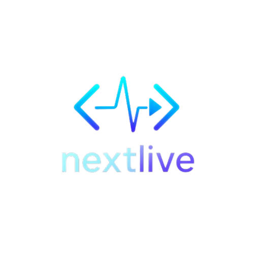
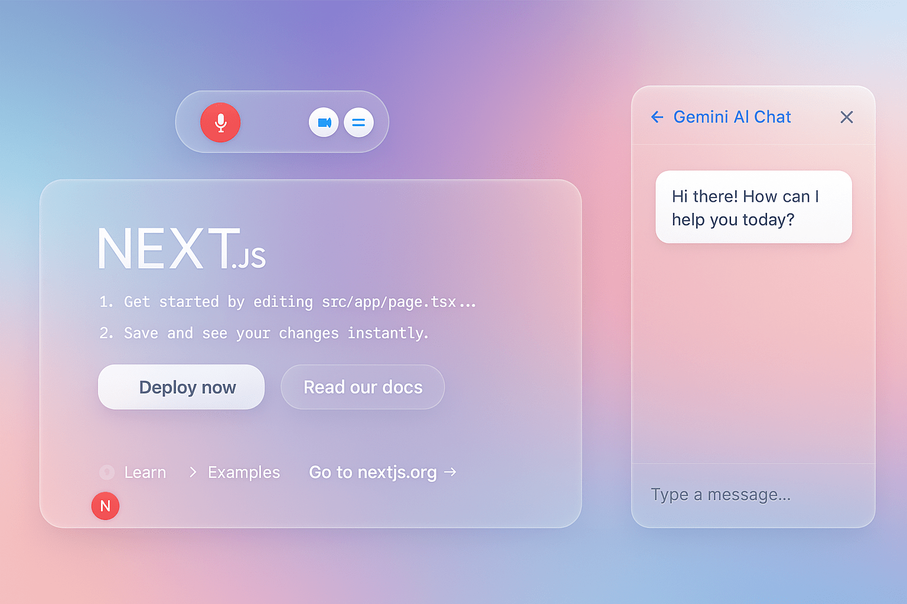

# NextLive


NextLive is a Next.js application that provides live collaboration and real-time features. The project is built using modern web technologies and follows best practices for React and Next.js development.

## Tech Stack

- **Framework**: Next.js 15.2.4
- **Language**: TypeScript
- **UI Libraries**: 
  - Material-UI (@mui/material)
  - Emotion (@emotion/react, @emotion/styled)
- **Markdown Processing**: react-markdown with remark-gfm
- **Image Processing**: html2canvas
- **AI Integration**: @google/generative-ai
- **Styling**: TailwindCSS
- **Development Tools**:
  - ESLint
  - TypeScript
  - Turbopack (for development)

## Project Structure

```
src/
├── app/                 # Next.js app router pages and layouts
├── nextlive/           # Custom NextLive feature implementation
│   ├── components/     # Reusable UI components
│   ├── services/       # Business logic and services
│   └── NextLive.tsx    # Main NextLive component
└── utils/              # Utility functions and helpers
```

## Key Features

1. **Live Collaboration**: Real-time collaboration features through the NextLive component
2. **Modern UI**: Built with Material-UI and Emotion for a polished user experience
3. **Type Safety**: Full TypeScript support for better development experience
4. **Markdown Support**: Rich text editing with Markdown support
5. **AI Integration**: Integration with Google's Generative AI

## Development

### Prerequisites

- Node.js (version compatible with Next.js 15)
- npm or yarn

### Installation

1. Clone the repository
2. Install dependencies:
   ```bash
   npm install
   ```

### Running the Development Server

```bash
npm run dev
```

The application will be available at `http://localhost:3000`

### Building for Production

```bash
npm run build
npm start
```

## Environment Variables

The project uses `.env.local` for environment-specific configuration. Make sure to set up the required environment variables before running the application.

## Contributing

1. Create a feature branch
2. Make your changes
3. Submit a pull request

## License

See [LISCENSE](LICENSE) for license

## Additional Notes

- The application uses Turbopack for faster development builds
- TailwindCSS is configured for styling
- ESLint is set up for code quality
- TypeScript is configured for type safety
